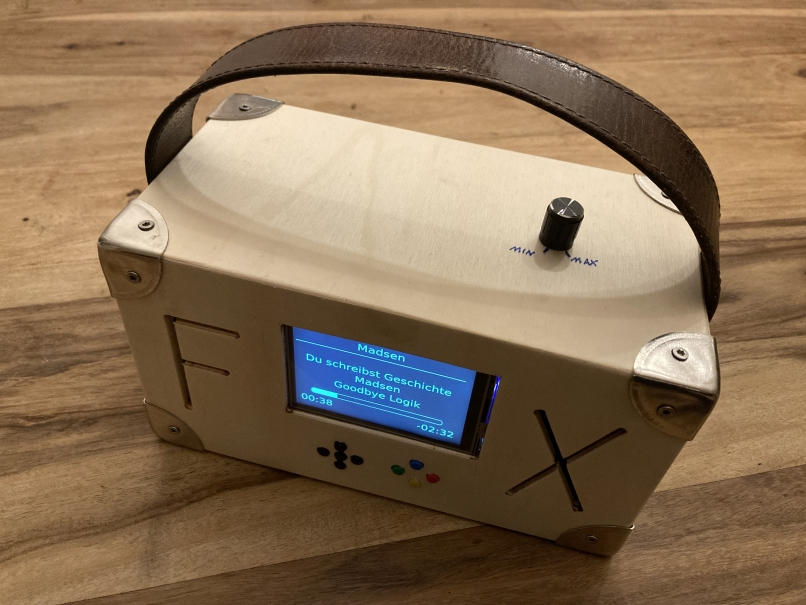
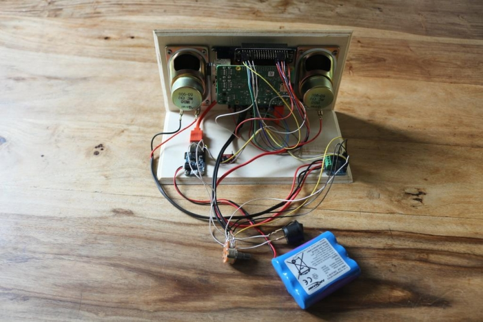

# tb.music_box
DIY Raspberry Pi Music Box

## Introduction and Goals

### Main requirements

* Portable Spotify Music Player
* Speaker power >=3W
* SNES Button interface

## Drivers and Constraints

* Easy to assemble
* Very robust -> Mechanics and software
* Children friendly
* Good sound quality
* Portability/Low power consumption

* Sound quality over Portability/Power consumption
* Costs: <300$

## System Context

* In/Out:
  * Display
  * USB
* In:
  * Buttons (SNES-Style)
  * Power supply
  * Power switch
  * Volume control
* Out:
  * Speaker

## Decisions

### Amplifier

* Stereo 3.7W Class D Audio Amplifier - MAX98306 + Klinkenanschluss: https://www.adafruit.com/product/987, https://learn.adafruit.com/stereo-3-7w-class-d-audio-amplifier, https://learn.adafruit.com/stereo-3-7w-class-d-audio-amplifier/inputs-and-outputs, https://learn.adafruit.com/stereo-3-7w-class-d-audio-amplifier/build-a-portable-sound-system, https://cdn-shop.adafruit.com/datasheets/MAX98306schem.png
  * Cheapest solution: https://forums.adafruit.com/viewtopic.php?f=19&t=144892, https://www.adafruit.com/product/1700, https://forums.adafruit.com/download/file.php?id=63172&sid=0f47a811efd81ec87bd2b66c538b6e77, https://learn.adafruit.com/adafruit-tpa2016-2-8w-agc-stereo-audio-amplifier?view=all, https://www.adafruit.com/product/1699
  * Uses Raspberry Pi (poor?) PWM Audio Out, needs some wiring, but receives good reviews

### Speaker

* Speaker: 8Ohm, 3 Watt

### Battery

* Lithium Ion Polymer Battery - 1S3P, 3,7V, 7800mAh

### Case

* Self-made (wood)

### Spotify client

* https://github.com/tbrandenburg/musicbox-spotify-client

## Building blocks

### Main parts list

|Part|Link|Cost|Amount|
|---|---|---|---|
|Raspberry Pi Model 3 A+|https://www.adafruit.com/product/4027|25$|1|
|PiTFT 3.5"|https://www.adafruit.com/product/2097|44.95$|1|
|PowerBoost 1000 Charger|https://www.adafruit.com/product/2465|19.95$|1|
|Amp|https://www.adafruit.com/product/987|9$|1|
|Speaker|tbd.|tbd.|2|
|Li 1S3P, 3,7V, 7800mAh|tbd.|30$|1|
|Case|self-made|self-made|1|

### Button circuit

* The buttons are connected to RPi via 10kOhm pull-up

## Knowledge

### Impedances

|Input/Output Type|Typical Impedance Range|Typical Voltage Range (Nominal)|
|---|---|---|
|Mic Level Output|50 \Omega to 600 \Omega|-60 dBV (1 mVRMS) to -40 dBV (10 mVRMS)|
|Mic Level Input|1.5 to 15 k\Omega|-60 dBV (1 mVRMS) to -40 dBV (10 mVRMS)|
|Instrument (Hi-Z) Level Output|10 k\Omega to 100 k\Omega|-20 dBu (77.5 mVRMS)|
|Instrument (Hi-Z) Level Input|47 k\Omega to over 10 M\Omega|-20 dBu (77.5 mVRMS)|
|Line Level (Professional) Output|75 to 600 \Omega|+4 dBu (1.228 VRMS)|
|Line Level (Professional) Input|10 k\Omega to 50 k\Omega|+4 dBu (1.228 VRMS)|
|Line Level (Consumer) Output|75 to 600 \Omega|-10 dBV (316 mVRMS)|
|Line Level (Consumer) Input|10 k\Omega to 50 k\Omega|-10 dBV (316 mVRMS)|
|Speaker Level Output|<100 m\Omega|20 dBV to 40 dBV (10 VRMS to 100 VRMS)|
|Speaker Level Input|4 \Omega to 16 \Omega|20 dBV to 40 dBV (10 VRMS to 100 VRMS)|
|Aux Output|75\Omega to 150 \Omega|-10 dBV (0.300 VRMS)|
|Aux Input|>10 k\Omega|-10 dBV (0.300 VRMS)|
|Headphone Jack Output|0.1 \Omega to <24 \Omega|N/A|
|Headphone Amplifier Output|0.5 \Omega to >120 \Omega|N/A|
|Headphone Input|8 \Omega to 600 \Omega|N/A|
|Raspberry Pi (PWM) Audio Jack Output|See Line-Out and note below|See Line-Out|

Note: https://hackaday.com/2018/07/13/behind-the-pin-how-the-raspberry-pi-gets-its-audio/

## References

* https://learn.adafruit.com/touch-pi-portable-raspberry-pi
* https://learn.adafruit.com/adafruit-pitft-3-dot-5-touch-screen-for-raspberry-pi
* https://learn.adafruit.com/raspberry-pi-radio-player-with-touchscreen
* https://www.reichelt.de/magazin/how-to/kodi-internetradio/
* https://learn.adafruit.com/raspberry-pi-as-a-media-center
* https://www.circuitbasics.com/setup-lcd-touchscreen-raspberry-pi/
* https://www.reddit.com/r/raspberry_pi/comments/3belpg/adafruit_pitft_kodi/
* https://www.opendisplaycase.de/opendisplaycase.html
* https://www.opendisplaycase.de/tutorials/raspberry-pi-raspian-tft-displays.html
* https://www.opendisplaycase.de/opendisplaycase/up-board-kodi-mediaplayer-box.html
* https://en.wikipedia.org/wiki/Line_level
* Can You Use The Headphone Jack with the MAX98306 amp?: https://forums.adafruit.com/viewtopic.php?f=19&t=144892
* http://www.sengpielaudio.com/Rechner-EingangsAusgangsWiderstand.htm
* https://www.pcwelt.de/ratgeber/Digitalradio-mit-DAB-9733609.html